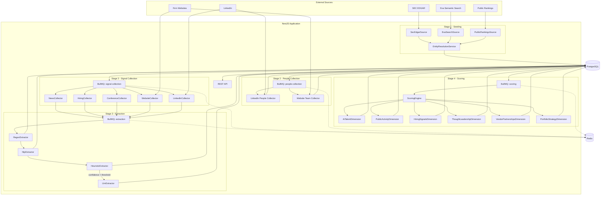
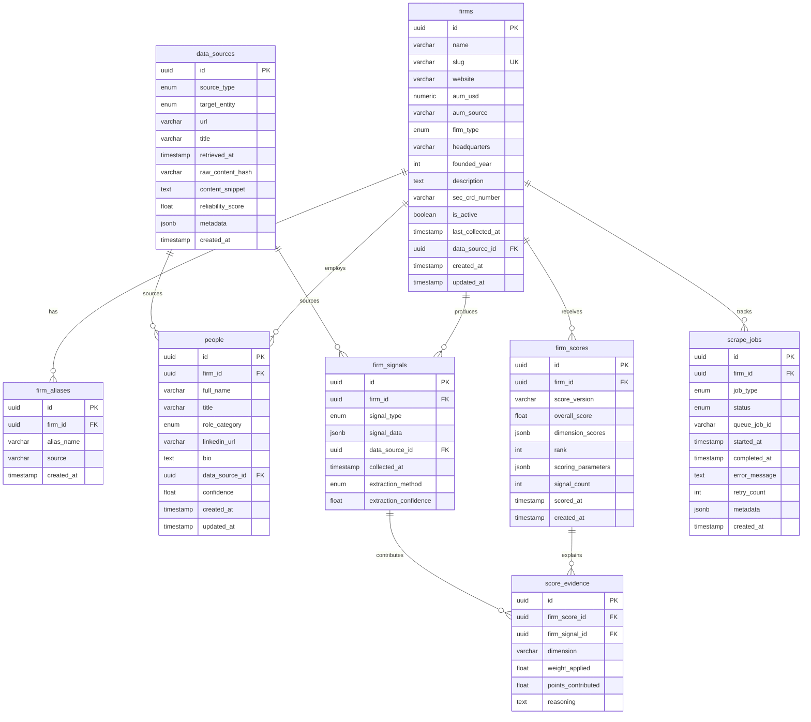
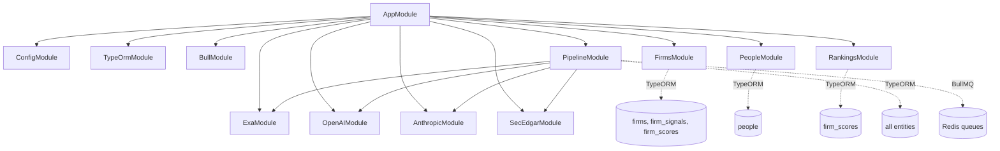

# Architecture

## Overview

The PE AI Intelligence system is a NestJS backend that discovers, scores, and ranks PE and private credit firms by their AI adoption maturity. It operates as a four-stage data pipeline backed by PostgreSQL for persistence and BullMQ (Redis) for asynchronous job processing.

Every score is explainable: a user can drill into any firm's score and trace it back through dimension breakdowns, individual signal evidence, extraction method, and the original public source URL.



## Technology Stack

| Layer             | Technology                           | Purpose                                          |
| ----------------- | ------------------------------------ | ------------------------------------------------ |
| Runtime           | Node.js + NestJS 11 + TypeScript     | Application framework with dependency injection  |
| Database          | PostgreSQL 16                        | Persistent storage for firms, signals, scores    |
| Queue             | BullMQ 5 + Redis 7                   | Async job processing for pipeline stages         |
| ORM               | TypeORM 0.3                          | Entity mapping, schema sync, query building      |
| LLM (default)     | Anthropic SDK                        | Extraction fallback when confidence is low       |
| LLM (alternate)   | OpenAI SDK                           | Switchable via `LLM_PROVIDER=openai`             |
| Web Search        | Exa SDK                              | Semantic search for discovering firms and signals |
| Web Scraping      | Axios + Cheerio                      | HTML fetching and parsing for firm websites      |
| NLP               | compromise                           | Lightweight entity recognition and text analysis |
| API Documentation | Swagger (OpenAPI)                    | Auto-generated interactive API docs at `/docs`   |
| Containerization  | Docker + docker-compose              | One-command infrastructure setup                 |
| Code Quality      | ESLint 9 (flat config) + Prettier    | Linting and formatting                           |
| Testing           | Jest + Supertest                     | Unit and e2e test runner                         |

## Project Structure

```
backend/
├── docker-compose.yml                      Postgres + Redis + app containers
├── .env.example                            All environment variables documented
├── package.json                            Dependencies and scripts
├── nest-cli.json                           Build config (copies seed-firms.json to dist/)
│
└── src/
    ├── main.ts                             Entry point: port, Swagger, global ValidationPipe
    ├── app.module.ts                       Root module wiring all sub-modules
    │
    ├── config/                             Typed config namespaces (database, redis, app, llm, scrapers)
    │
    ├── common/
    │   ├── enums/                          FirmType, SignalType, SourceType, ExtractionMethod, JobType, etc.
    │   ├── interfaces/                     ScoringConfig, ExtractionResult, Extractor contract, metadata shapes
    │   └── utils/                          Rate limiter, text normalization, content hashing, job logger
    │
    ├── database/
    │   └── entities/                       8 TypeORM entities (see schema below)
    │
    ├── integrations/
    │   ├── exa/                            Exa API client (semantic web search)
    │   ├── openai/                         OpenAI client (LLM extraction)
    │   ├── anthropic/                      Anthropic client (LLM extraction, default)
    │   └── sec-edgar/                      SEC EDGAR client (Form ADV, CIK lookup)
    │
    └── modules/
        ├── firms/                          GET /api/firms — list, detail, signals, scores
        ├── people/                         GET /api/people — list, firm-specific people
        ├── rankings/                       GET /api/rankings — ranked firms, dimension breakdown
        └── pipeline/
            ├── pipeline.controller.ts      POST seed/collect/score/rescore, GET status
            ├── seeding/                    Stage 1: three sources + entity resolution + enrichment
            ├── collection/                 Stage 2: BullMQ processors + 5 signal collectors + 2 people collectors
            ├── extraction/                 Stage 3: layered pipeline + 4 extractors
            └── scoring/                    Stage 4: engine + 6 dimension scorers
```

## Database Schema



## Key Design Decisions

### Raw signals vs. derived scores

The `firm_signals` table holds evidence collected from public sources. The `firm_scores` table holds computed outputs. This separation lets you re-score every firm without re-scraping by replaying signals through a new scoring configuration.

### Score versioning

Every scoring run is tagged with a `score_version` string (e.g. `v1.0`, `v2.0-experimental`). The `scoring_parameters` JSONB column stores the exact weights and thresholds used, making every score fully reproducible. A unique constraint on `(firm_id, score_version)` ensures one score per firm per version.

### Source provenance

Every signal links back to a `data_sources` row which stores the URL, retrieval timestamp, content hash, and a reliability score. A user can trace any score contribution back to its original source.

### Content deduplication

The `raw_content_hash` (SHA-256) on `data_sources` prevents re-processing identical content across collection runs.

### Entity resolution

The `firm_aliases` table stores all known name variants for a firm. The `EntityResolutionService` normalizes names, computes Levenshtein distance (15% threshold), and matches by website domain to merge duplicates during seeding.

### Layered extraction (cost optimization)

The extraction pipeline cascades from cheap (regex) to expensive (LLM). The LLM is only invoked when all prior layers produce zero high-confidence results, minimizing API token costs.

### Async pipeline via BullMQ

Long-running pipeline stages (seeding, collection, extraction, scoring) are processed through BullMQ queues. This provides retry support (3 attempts with exponential backoff for collection), concurrency control (10 workers per queue), and progress monitoring via the status endpoint.

### UUID v7 primary keys

All entities use UUID v7 (time-ordered UUIDs), which preserves insertion order while avoiding sequential ID enumeration.

## Module Dependency Graph



## Environment Variables

| Variable | Required | Default | Description |
|----------|----------|---------|-------------|
| `DB_HOST` | Yes | `localhost` | PostgreSQL host |
| `DB_PORT` | Yes | `5432` | PostgreSQL port |
| `DB_USERNAME` | Yes | `postgres` | PostgreSQL user |
| `DB_PASSWORD` | Yes | `postgres` | PostgreSQL password |
| `DB_DATABASE` | Yes | `pe_intelligence` | PostgreSQL database name |
| `REDIS_HOST` | Yes | `localhost` | Redis host |
| `REDIS_PORT` | Yes | `6379` | Redis port |
| `EXA_API_KEY` | Yes | — | Exa API key (semantic web search) |
| `ANTHROPIC_API_KEY` | Conditional | — | Required if `LLM_PROVIDER=anthropic` (default) |
| `OPENAI_API_KEY` | Conditional | — | Required if `LLM_PROVIDER=openai` |
| `LLM_PROVIDER` | No | `anthropic` | LLM provider: `anthropic` or `openai` |
| `SEC_EDGAR_USER_AGENT` | Yes | — | User-agent for SEC EDGAR (use real email) |
| `PORT` | No | `3000` | Application port |
| `NODE_ENV` | No | `development` | `development` enables schema sync + query logging |
| `EXTRACTION_CONFIDENCE_THRESHOLD` | No | `0.5` | Min confidence for extraction results (0–1) |
