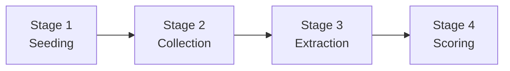
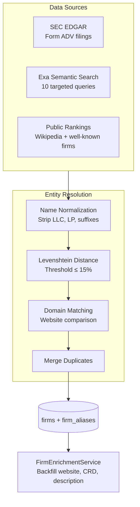
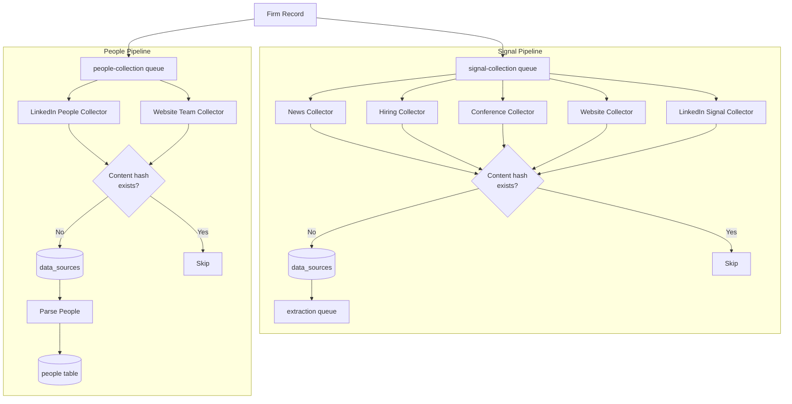
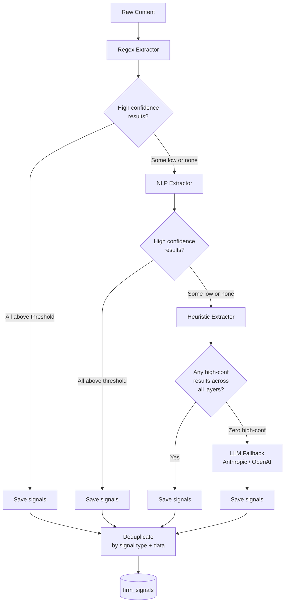
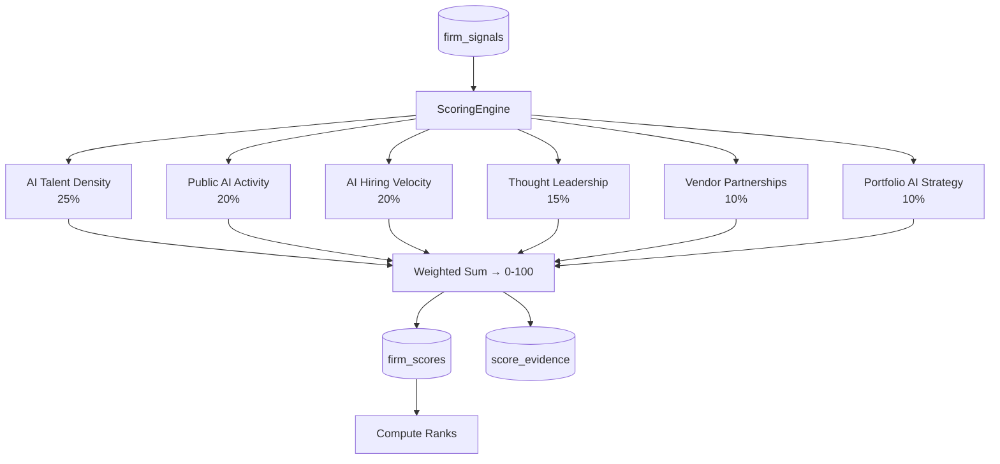
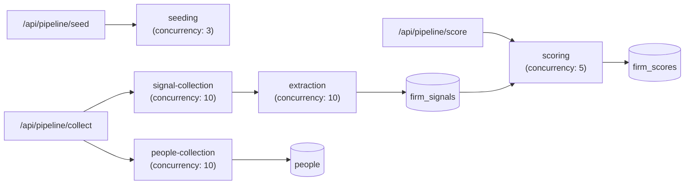
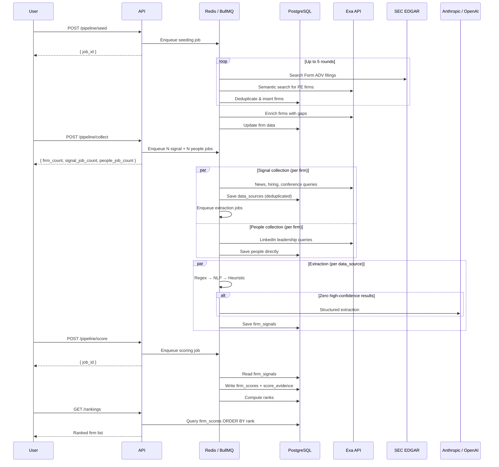

# Data Pipeline

The system operates as a four-stage pipeline. Each stage can be triggered independently, and all stages run asynchronously via BullMQ queues.

## Stage Overview

| Stage | Name           | Purpose |
| ----- | -------------- | ------- |
| 1     | **Seeding**    | Build the firm universe from SEC filings, semantic web search, and public rankings. Deduplicates via entity resolution. |
| 2     | **Collection** | Gather raw evidence: a **signal pipeline** (news, hiring, conferences, website, LinkedIn) feeding extraction, and a **people pipeline** (LinkedIn profiles, team pages) writing directly to the `people` table. |
| 3     | **Extraction** | Turn raw text into structured signals via a layered cascade (regex → NLP → heuristics → LLM fallback). The LLM is only invoked when cheaper layers fail. |
| 4     | **Scoring**    | Score six weighted dimensions (talent, activity, hiring velocity, thought leadership, vendors, portfolio strategy) producing a 0–100 overall score with a full evidence chain. |

---

## Stage 1 — Firm Universe Seeding

**Queue:** `seeding` (concurrency: 3)

Seeds the database with PE and private credit firms from three sources running in parallel. The job runs up to **5 rounds** until the DB reaches the `target_firm_count` or two consecutive rounds yield zero new firms.

### Entity Resolution

The `EntityResolutionService` deduplicates candidates using three strategies applied in order:

1. **Exact match** on normalized name (lowercase, suffixes stripped).
2. **Domain match** — if two candidates share the same website domain, they are the same firm.
3. **Fuzzy match** — Levenshtein distance relative to name length, with a 15% threshold.

When merging, the service keeps the most complete data: largest AUM, first non-null website, first non-null firm type, etc. All original name variants are stored as `firm_aliases` for future matching.

### Diversified Selection

Source quotas ensure a balanced firm universe: ~30% SEC, ~30% Exa, ~40% public rankings, then backfill by AUM.

### Post-Seeding Enrichment

After seeding, `FirmEnrichmentService.enrichFirmsWithGaps` runs automatically to backfill missing data (website via Exa, CRD/CIK via SEC EDGAR, descriptions via website crawl).

---

## Stage 2 — Collection

**Queues:** `signal-collection` and `people-collection` (concurrency: 10 each, lock duration: 5 min)

Creates **two BullMQ jobs per firm**, processed in parallel on separate queues:

### Signal Collectors

| Collector | Method | What it finds | Lookback |
| --------- | ------ | ------------- | -------- |
| News | Exa semantic search (category: news) | AI-related news mentions | 1 year |
| Hiring | Exa search + site-scoped if website known | Data/ML/AI job postings | 6 months |
| Conference | Exa semantic search | Conference talks, podcasts, thought leadership | 2 years |
| Website | Direct HTTP (Axios + Cheerio) on 6 paths | `/`, `/about`, `/technology`, `/data`, `/innovation`, `/portfolio` | Current |
| LinkedIn Signals | Exa search scoped to linkedin.com | AI adoption posts, ML/GenAI mentions | 1 year |

### People Collectors

| Collector | Method | What it finds |
| --------- | ------ | ------------- |
| LinkedIn People | Exa search scoped to linkedin.com | CDO, CTO, Head of Data/AI, VP Technology profiles |
| Website Team | Direct HTTP on 4 paths (`/team`, `/people`, `/leadership`, `/about/team`) | Team page bios parsed via regex |

People are parsed in-process (no separate extraction queue) and written directly to the `people` table with inferred role categories (`head_of_data`, `head_of_tech`, `operating_partner`, `ai_hire`, `other`).

### Idempotency

Every collected document is hashed with SHA-256. Before saving, the hash is checked against existing `data_sources` records. Duplicates are silently skipped. Re-running collection is safe.

### Rate Limiting

All external calls go through per-source token-bucket rate limiters:

| Source | Max Concurrent | Delay Between Requests |
| ------ | -------------- | ---------------------- |
| Exa API | 2 | 500ms |
| SEC EDGAR | 1 | 1200ms |
| General Web | 3 | 1000ms |

### Reliability Scoring

Each `data_sources` record receives a reliability score based on domain:

| Domain Pattern | Score |
| -------------- | ----- |
| `.gov` (SEC, government) | 0.95 |
| Bloomberg, Reuters, WSJ, FT | 0.90 |
| TechCrunch, Business Insider | 0.75 |
| LinkedIn | 0.70 |
| Other | 0.50 |

---

## Stage 3 — Extraction

**Queue:** `extraction` (concurrency: 10, lock duration: 5 min)

**Trigger:** Automatic — each new `data_sources` row created during signal collection enqueues an extraction job.

The extraction pipeline is layered. Each layer runs only if previous layers did not produce sufficient high-confidence results. The confidence threshold is configurable via `EXTRACTION_CONFIDENCE_THRESHOLD` (default: `0.5`).

### Extractor Layers

| Layer | Confidence Range | Approach |
| ----- | ---------------- | -------- |
| **Regex** | 0.80 – 0.90 | Pattern-matching for structured data: executive hires, vendor partnerships, AUM mentions, job postings, conference appearances, portfolio AI strategy |
| **NLP** | 0.50 – 0.80 | `compromise` library: AI keyword density (20+ terms), people in AI-related sentences, sentence intent classification |
| **Heuristic** | 0.50 – 0.85 | Rule-based keyword bundles for leadership roles, operating partner mandates, portfolio + AI combinations, tech stack mentions |
| **LLM** | capped at 0.85 | Structured JSON extraction via Anthropic (default) or OpenAI. Only invoked when **all prior layers produce zero high-confidence results**. Temperature 0.1, input truncated to 8,000 chars. |

The LLM provider is configurable via `LLM_PROVIDER` env var (`anthropic` by default, `openai` as alternative).

---

## Stage 4 — Scoring

**Queue:** `scoring` (concurrency: 5)

The scoring engine is pure TypeScript with no LLM involvement. It reads all `firm_signals` for a firm and passes them through six independent dimension scorers.

### Scoring Dimensions

Each dimension scores 0–100 internally, then the weighted sum produces the overall score.

| Dimension | Weight | Signal Types | Scoring Logic |
| --------- | ------ | ------------ | ------------- |
| AI Talent Density | 25% | `ai_team_growth`, `ai_hiring` | Senior hires (15 pts, cap 45), team growth (10 pts, cap 30), general hires (5 pts, cap 25) |
| Public AI Activity | 20% | `ai_news_mention`, `ai_case_study`, `linkedin_ai_activity` | News (8 pts, cap 40), case studies (15 pts, cap 35), LinkedIn (5 pts, cap 25) |
| AI Hiring Velocity | 20% | `ai_hiring` | Recent 6mo (12 pts, cap 50), older (5 pts, cap 25), role diversity bonus (5 pts/role, cap 25) |
| Thought Leadership | 15% | `ai_conference_talk`, `ai_podcast`, `ai_research` | Conferences (15 pts, cap 40), podcasts (12 pts, cap 30), research (15 pts, cap 30) |
| Vendor Partnerships | 10% | `ai_vendor_partnership`, `tech_stack_signal` | Unique vendors (20 pts, cap 60), tech stack (10 pts, cap 40) |
| Portfolio AI Strategy | 10% | `portfolio_ai_initiative`, `ai_case_study` | Portfolio initiatives (20 pts, cap 60), portfolio case studies (15 pts, cap 40) |

### Evidence Chain

Every point contributed to a score is recorded in `score_evidence`, linking the `firm_score` to the specific `firm_signal` that produced it, along with the dimension, weight applied, points contributed, and a human-readable reasoning string.

### Score Versioning and Re-scoring

Scoring runs are tagged with a `version` string (e.g. `v1.0`, `v2.0-talent-heavy`). Weights and thresholds are fully configurable per run. To A/B test scoring:

1. Call the re-score endpoint with a new version string and different weights.
2. The engine replays all existing `firm_signals` through the new config (no re-scraping).
3. New `firm_scores` rows are created with the new version tag. Rankings are recomputed.
4. Compare versions side by side via the rankings or firm scores endpoints.

---

## Queue Architecture

| Queue | Concurrency | Retry | Purpose |
| ----- | ----------- | ----- | ------- |
| `seeding` | 3 | 1 attempt | Discover and persist firms |
| `signal-collection` | 10 | 3 attempts, exponential backoff 5s | Collect AI evidence per firm |
| `people-collection` | 10 | 3 attempts, exponential backoff 5s | Collect AI-relevant people per firm |
| `extraction` | 10 | — | Extract structured signals from raw content |
| `scoring` | 5 | — | Score firms across six dimensions |

---

## Full Pipeline Sequence

