# End-to-End Pipeline Cheat Sheet

One-page reference of everything that happens from "empty database" to "outreach campaigns sitting in front of an analyst". Each stage is async via BullMQ and auto-chains to the next.

```mermaid
flowchart TB
    classDef stage fill:#1e3a5f,stroke:#4a90e2,stroke-width:2px,color:#fff
    classDef store fill:#2d4a2e,stroke:#7cb342,stroke-width:1.5px,color:#fff
    classDef llm fill:#5a2d5f,stroke:#ba68c8,stroke-width:1.5px,color:#fff
    classDef api fill:#5f4a1e,stroke:#ffb300,stroke-width:1.5px,color:#fff

    %% STAGE 1
    subgraph S1 [" 1. SEEDING & ENRICHMENT (queue: seeding) "]
        direction TB
        S1A[Discover firms<br/>• SEC EDGAR Form ADV<br/>• Exa ~40 targeted queries<br/>• Public rankings / Wikipedia]:::api
        S1B[Entity resolution<br/>• normalize name<br/>• domain match<br/>• Levenshtein ≤ 15%]
        S1C[Diversified select<br/>30% SEC / 30% Exa / 40% public<br/>Backfill by AUM]
        S1D[Enrich gaps<br/>• Wikipedia infobox: HQ, AUM, founded<br/>• Exa prose: website, firm type<br/>• Website crawl: description<br/>• SEC: CRD number]:::api
        S1A --> S1B --> S1C --> S1D
    end
    S1 -->|writes| FIRMS[(firms<br/>+ firm_aliases<br/>+ data_sources)]:::store

    %% STAGE 2 - SIGNALS
    subgraph S2A [" 2a. SIGNAL COLLECTION (queue: signal-collection, 1 job / firm) "]
        direction TB
        COL1[News · Hiring · Conference · Website · LinkedIn]:::api
        COL2{SHA-256 hash<br/>dedup vs<br/>data_sources}
        COL3[Reliability scored 0.50-0.95<br/>by domain]
        COL1 --> COL2 -->|new| COL3
    end

    %% STAGE 2 - PEOPLE
    subgraph S2B [" 2b. PEOPLE COLLECTION (queue: people-collection, 1 job / firm) "]
        direction TB
        PCOL1[Exa LinkedIn people search<br/>+ Website team pages<br/>+ SEC IAPD Form ADV principals]:::api
        PCOL2{SHA-256 hash dedup}
        PCOL3[LlmPeopleExtractor<br/>batched 6 sources / call<br/>returns name, title, bio, email, LinkedIn]:::llm
        PCOL4[Strategy:<br/>1 SEC parsedPeople → 0.85 conf<br/>2 LLM output → LinkedIn filtered to AI roles<br/>3 Regex fallback if LLM disabled<br/>Emails from mailto + LLM verbatim only]
        PCOL1 --> PCOL2 -->|new| PCOL3 --> PCOL4
    end

    FIRMS --> S2A
    FIRMS --> S2B
    S2A -->|new data_sources<br/>auto-enqueue per source| S3
    S2A -->|tracks pending<br/>extractions counter| ORCH[(Redis counter<br/>pipeline:firm:ID:<br/>pending_extractions)]:::store
    S2B -->|direct write| PEOPLE[(people)]:::store

    %% STAGE 3
    subgraph S3 [" 3. EXTRACTION (queue: extraction, 1 job / data_source) "]
        direction TB
        E1[Layer 1 REGEX<br/>conf 0.80-0.90<br/>exec hires, vendors, AUM, jobs, conferences]
        E2[Layer 2 NLP compromise<br/>conf 0.50-0.80<br/>AI keyword density, sentence intent]
        E3[Layer 3 HEURISTIC<br/>conf 0.50-0.85<br/>role bundles, portfolio + AI keywords]
        E4[Layer 4 LLM FALLBACK<br/>capped 0.85 · only when zero high-conf prior<br/>Anthropic default / OpenAI<br/>8000 chars truncation, temp 0.1]:::llm
        E5[Dedup by signal_type + data hash]
        E1 -->|all above threshold?| E5
        E1 -->|some low or zero| E2 -->|ok?| E5
        E2 -->|some low or zero| E3 -->|any high-conf<br/>across all 3?| E5
        E3 -->|zero high-conf| E4 --> E5
    end
    S3 -->|write| SIG[(firm_signals<br/>11 signal types)]:::store
    S3 -->|decrement counter.<br/>when 0: enqueue scoring| ORCH

    %% STAGE 4
    subgraph S4 [" 4. SCORING (queue: scoring, 1 job / firm, pure TypeScript) "]
        direction TB
        SC1[ScoringEngine reads all signals<br/>skip if < min_signals_for_score default 1]
        SC2[6 DIMENSIONS — each 0-100, weighted]
        SC3[AI Talent Density<br/>weight 25%<br/>senior hires Chief/Head/VP/Director: 15 pt ea, cap 45<br/>team growth: 10 pt ea, cap 30<br/>other AI hires: 5 pt ea, cap 25]
        SC4[Public AI Activity<br/>weight 20%<br/>news: 8 pt ea, cap 40<br/>case studies: 15 pt ea, cap 35<br/>LinkedIn posts: 5 pt ea, cap 25]
        SC5[AI Hiring Velocity<br/>weight 20%<br/>last 6mo: 12 pt ea, cap 50<br/>older: 5 pt ea, cap 25<br/>role diversity bonus: 5 pt / role, cap 25]
        SC6[Thought Leadership<br/>weight 15%<br/>conferences: 15 pt ea, cap 40<br/>podcasts: 12 pt ea, cap 30<br/>research: 15 pt ea, cap 30]
        SC7[Vendor Partnerships<br/>weight 10%<br/>unique vendors: 20 pt ea, cap 60<br/>tech stack: 10 pt ea, cap 40]
        SC8[Portfolio AI Strategy<br/>weight 10%<br/>portfolio initiatives: 20 pt ea, cap 60<br/>portfolio case studies: 15 pt ea, cap 40]
        SC9[overall_score = Σ dim_score × weight<br/>Recompute ranks across version<br/>Every point logged in score_evidence]
        SC1 --> SC2
        SC2 --> SC3 --> SC9
        SC2 --> SC4 --> SC9
        SC2 --> SC5 --> SC9
        SC2 --> SC6 --> SC9
        SC2 --> SC7 --> SC9
        SC2 --> SC8 --> SC9
    end
    SIG --> S4
    S4 -->|write| SCORES[(firm_scores<br/>+ score_evidence<br/>tagged by score_version)]:::store

    %% STAGE 5
    subgraph S5 [" 5. SALES AUTO-SEED (queue: outreach-campaigns) "]
        direction TB
        O1[For each person in firm<br/>without an existing campaign]
        O2[Bulk-create campaign<br/>status: not_contacted<br/>contact_platforms: empty<br/>contacted_by: null]
        O3[Later, on analyst demand:<br/>POST /outreach/:id/generate-message<br/>→ LLM: firm + person + 15 signals + score + 5 source excerpts<br/>→ save outreach_message ≤ 200 words]:::llm
        O1 --> O2 --> O3
    end
    S4 -->|per-firm scoring done<br/>enqueue| S5
    PEOPLE --> S5
    SCORES --> S5
    S5 -->|write| CAMP[(outreach_campaigns)]:::store

    %% API
    FIRMS --> API[REST + Swagger<br/>/api/firms /people /rankings /pipeline /outreach<br/>GET /pipeline/status — live queue counts]:::api
    SIG --> API
    SCORES --> API
    PEOPLE --> API
    CAMP --> API

    class S1,S2A,S2B,S3,S4,S5 stage
```



## Key numbers at a glance

| What | Value |
|------|-------|
| Firm discovery rounds | up to 5 (stop at target or 2 empty rounds) |
| Entity match threshold | Levenshtein ≤ 15% of name length |
| Source quota (seeding) | 30% SEC / 30% Exa / 40% public, backfill by AUM |
| Enrichment batch | 15 firms in parallel |
| Signal lookbacks | news 1y · hiring 6mo · conference 2y · LinkedIn signals 1y |
| LinkedIn AI-role filter (people) | keep HEAD_OF_DATA / HEAD_OF_TECH / OPERATING_PARTNER / AI_HIRE, or titles containing data/AI/CTO/CDO/analytics/… |
| LLM people batch | `LLM_PEOPLE_BATCH_SIZE` (default 6 sources / call) |
| Extraction confidence threshold | `EXTRACTION_CONFIDENCE_THRESHOLD` (default 0.5) |
| Extraction LLM gate | invoked **only** when zero high-confidence results from regex + NLP + heuristic |
| Scoring min signals | `min_signals_for_score` (default 1) — else no score row |
| Default weights | 25 / 20 / 20 / 15 / 10 / 10 |
| Overall score | `Σ (dim_score_0-100 × weight)` → `0-100` |
| Rank | `RANK() OVER (ORDER BY overall_score DESC)` per `score_version` |
| Auto-chain toggle | `PIPELINE_AUTO_CHAIN` (default `true`) |
| Cron (full run) | `PIPELINE_CRON_SCHEDULE` default `0 0 * * 0` — Sun midnight |

## Six scoring dimensions — one-liner each

1. **AI Talent Density (25%)** — how many senior AI/tech leaders + team-growth signals.
2. **Public AI Activity (20%)** — news mentions + case studies + LinkedIn posts about AI.
3. **AI Hiring Velocity (20%)** — weighted toward last 6 months + role diversity bonus.
4. **Thought Leadership (15%)** — conference talks, podcasts, research publications.
5. **Vendor Partnerships (10%)** — unique AI vendor partnerships + tech-stack mentions.
6. **Portfolio AI Strategy (10%)** — portfolio-company AI initiatives + portfolio-tagged case studies.

## Two LLM roles (don't confuse them)

| Use | Called from | Purpose |
|-----|-------------|---------|
| **Signal extraction** | `extraction` queue (Stage 3) | Last-resort fallback when regex/NLP/heuristic all fail. Anthropic default, OpenAI alternate. Schema-constrained JSON, temp 0.1. |
| **People extraction** | `people-collection` in-process (Stage 2b) | **Primary** parser for unstructured LinkedIn/website sources. SEC ADV bypasses it. |
| **Outreach message** | On-demand via `/api/outreach/:id/generate-message` (Stage 5) | Personalized message using firm + person + signals + score context. |

## Evidence chain (how to defend a score)

```
firm_scores (overall_score, score_version)
   └── dimension_scores (JSONB: ai_talent_density, public_ai_activity, ...)
         └── score_evidence (rows per point contributed)
               └── firm_signals (signal_type, signal_data, extraction_method, confidence)
                     └── data_sources (url, retrieved_at, raw_content_hash, reliability_score)
```

Every overall score drills all the way back to the original URL.
