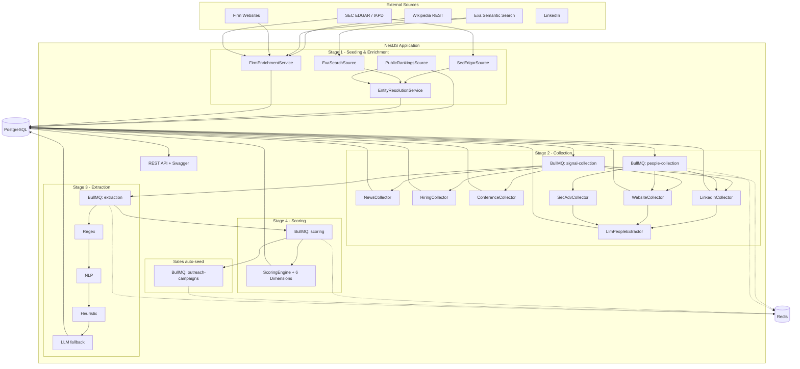
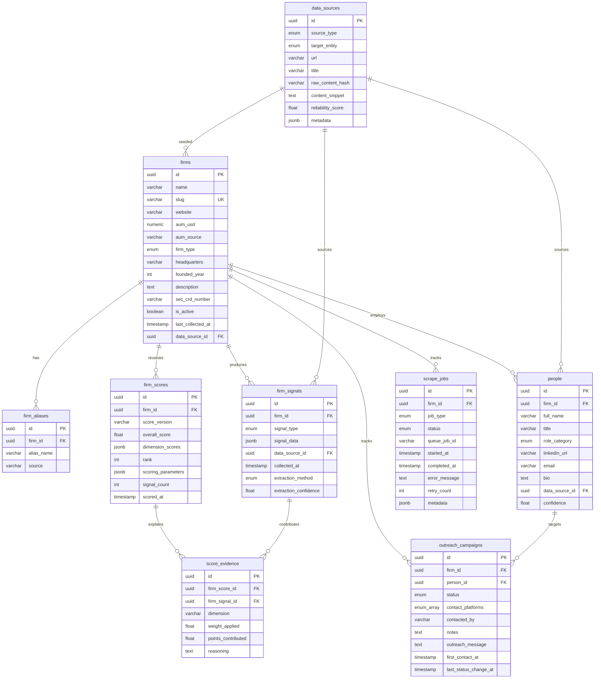
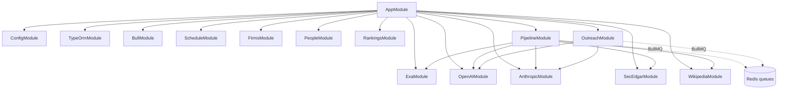

# Data Pipeline — Architecture

## Overview

A NestJS backend that discovers PE/private-credit firms, gathers public evidence of their AI adoption, turns that evidence into structured signals, and produces an explainable 0–100 score per firm. Scoring completion auto-seeds sales outreach campaigns (see [sales pipeline](../sales-pipeline/ARCHITECTURE.md)).

Every score is traceable end-to-end: score → dimension breakdown → evidence entries → source signal → original URL.



## Technology Stack

| Layer | Technology | Purpose |
|-------|------------|---------|
| Runtime | Node.js 20 + NestJS 11 + TypeScript | App framework with DI |
| Database | PostgreSQL 16 | Persistence (firms, signals, scores, people, campaigns) |
| Queue | BullMQ 5 + Redis 7 | Async job processing, orchestrator counters |
| ORM | TypeORM 0.3 | Entity mapping + schema sync |
| LLM | Anthropic SDK (default) / OpenAI SDK | Signal extraction fallback, people extraction, outreach message generation |
| Web search | Exa SDK | Firm discovery, signal collection, enrichment |
| Reference data | Wikipedia REST API | Infobox-based firm enrichment (description, HQ, AUM, founded year) |
| Regulatory data | SEC EDGAR + IAPD APIs | CRD/CIK lookup, Form ADV principals |
| Web scraping | Axios + Cheerio | Firm websites, team pages, mailto extraction |
| NLP | compromise | Lightweight entity/sentence classification |
| API docs | Swagger (OpenAPI) | Interactive docs at `/docs` |
| Scheduling | `@nestjs/schedule` + cron | Weekly full pipeline run |
| Testing | Jest + Supertest | Unit + E2E |

## Project Structure

```
backend/
├── docker-compose.yml                      Postgres + Redis + app
├── docker-compose.test.yml                 Test-only Postgres + Redis
├── .env.example                            All environment variables
│
└── src/
    ├── main.ts                             Entry point + Swagger
    ├── app.module.ts                       Root wiring
    │
    ├── config/                             Typed config namespaces (app, database, redis, llm, pipeline, scrapers)
    │
    ├── common/
    │   ├── enums/                          FirmType, SignalType, SourceType, RoleCategory, OutreachStatus, ContactPlatform, etc.
    │   ├── interfaces/                     ScoringConfig, ExtractionResult, EvidenceEntry, DimensionScoreKey
    │   └── utils/                          Rate limiters, text/hash utils, CommonLogger, HTTP error helpers
    │
    ├── database/entities/                  10 TypeORM entities (see schema below)
    │
    ├── integrations/
    │   ├── exa/                            Semantic web search (search + getContents)
    │   ├── openai/                         LLM signals + people + free-form completion (gpt-4o / gpt-4o-mini)
    │   ├── anthropic/                      LLM signals + people + free-form completion (claude-sonnet-4, default)
    │   ├── sec-edgar/                      CIK lookup, Form ADV filings (EDGAR full-text search)
    │   └── wikipedia/                      Page resolution + infobox parser for firm enrichment
    │
    └── modules/
        ├── firms/                          GET /api/firms — list, detail, signals, scores
        ├── people/                         GET /api/people — list, by-firm
        ├── rankings/                       GET /api/rankings — overall & per-dimension
        ├── sales-pipeline/outreach/        Outreach campaigns + LLM message generation
        └── pipeline/
            ├── pipeline.controller.ts      POST seed/collect/score/rescore, GET status
            ├── pipeline-orchestrator.service.ts  Auto-chains stages via Redis counters
            ├── pipeline-cron.service.ts    Weekly scheduled full run
            ├── seeding/                    SEC + Exa + Public + EntityResolution + FirmEnrichment
            ├── collection/                 Signal + people BullMQ processors, 6 collectors, LlmPeopleExtractor
            ├── extraction/                 Layered Regex → NLP → Heuristic → LLM
            └── scoring/                    Engine + 6 dimension scorers
```

## Database Schema



Note: `outreach_campaigns.contact_platforms` is a **PostgreSQL array** of `ContactPlatform` enum values (a campaign can use multiple channels).

## Key Design Decisions

- **Signals vs. scores** — Raw evidence (`firm_signals`) is separated from derived outputs (`firm_scores`), so you can A/B test new scoring weights without re-scraping.
- **Score versioning** — Every scoring run carries a `score_version` string. `scoring_parameters` JSONB stores the exact weights/thresholds used. Unique constraint on `(firm_id, score_version)`.
- **Source provenance** — Every signal and every person links to a `data_sources` row with URL, hash, reliability score, and retrieval timestamp.
- **Content dedup** — SHA-256 `raw_content_hash` on `data_sources` prevents re-processing identical content.
- **Entity resolution** — `EntityResolutionService` merges duplicate firms via normalized-name exact match, website-domain match, and Levenshtein distance (≤15%). All variants persisted as `firm_aliases`.
- **Layered extraction** — Signal extraction cascades regex → NLP → heuristic → LLM. The LLM is invoked only when **zero** prior layers produced a high-confidence result, minimizing tokens.
- **LLM-assisted people extraction** — In people collection, `LlmPeopleExtractor` is the primary parser for unstructured sources (LinkedIn snippets, firm team pages). SEC ADV results arrive pre-structured and skip the LLM entirely. Regex remains as a final fallback when the LLM is disabled or returns nothing.
- **Auto-chaining** — `PipelineOrchestratorService` chains stages at the process level via Redis counters: seed → collect → extract → score (per firm) → outreach. Toggleable via `PIPELINE_AUTO_CHAIN`.
- **UUID v7 primary keys** — Time-ordered UUIDs preserve insertion order without sequential ID enumeration.

## Module Dependency Graph



Registered BullMQ queues: `seeding`, `signal-collection`, `people-collection`, `extraction`, `scoring`, `outreach-campaigns`.

## Environment Variables

| Variable | Required | Default | Description |
|----------|----------|---------|-------------|
| `DB_HOST` / `DB_PORT` / `DB_USERNAME` / `DB_PASSWORD` / `DB_DATABASE` | Yes | `localhost` / `5432` / `postgres` / `postgres` / `pe_intelligence` | PostgreSQL connection |
| `REDIS_HOST` / `REDIS_PORT` | Yes | `localhost` / `6379` | Redis connection |
| `EXA_API_KEY` | Yes | — | Semantic web search |
| `ANTHROPIC_API_KEY` | Conditional | — | Required when `LLM_PROVIDER=anthropic` (default) |
| `OPENAI_API_KEY` | Conditional | — | Required when `LLM_PROVIDER=openai` |
| `LLM_PROVIDER` | No | `anthropic` | `anthropic` or `openai` |
| `LLM_PEOPLE_ENABLED` | No | `true` | Set `false` to disable LLM people extraction (regex-only fallback) |
| `LLM_PEOPLE_BATCH_SIZE` | No | `6` | Sources per LLM people-extraction call |
| `SEC_EDGAR_USER_AGENT` | Yes | — | User-agent for SEC EDGAR + IAPD (use a real email) |
| `PORT` | No | `3000` | Application port |
| `NODE_ENV` | No | `development` | `development` enables TypeORM schema sync + query logging |
| `EXTRACTION_CONFIDENCE_THRESHOLD` | No | `0.5` | Minimum confidence for extraction results (0–1) |
| `PIPELINE_AUTO_CHAIN` | No | `true` | Enable auto-chaining between pipeline stages |
| `PIPELINE_CRON_SCHEDULE` | No | `0 0 * * 0` | Cron expression for the weekly full run (default: Sunday midnight) |
| `PIPELINE_SEED_TARGET` | No | `50` | Target firm count for cron-triggered seeding |
