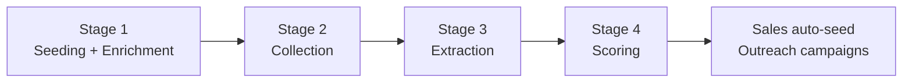
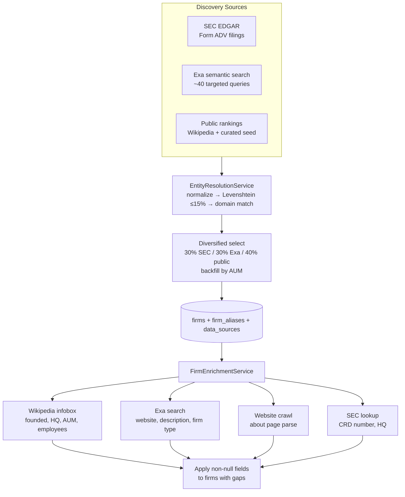
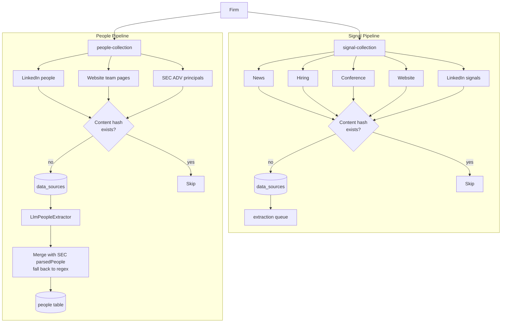
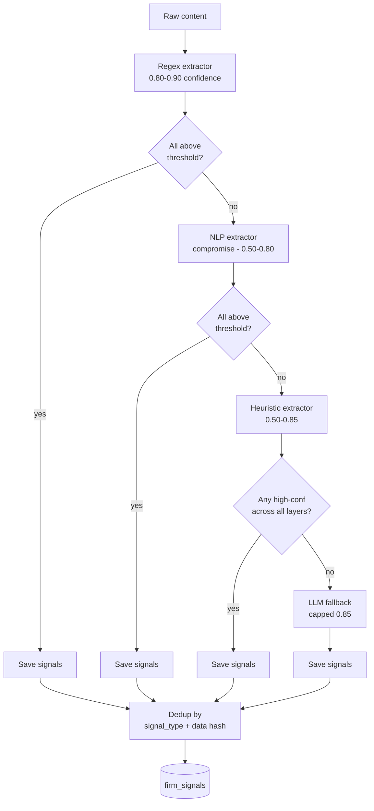
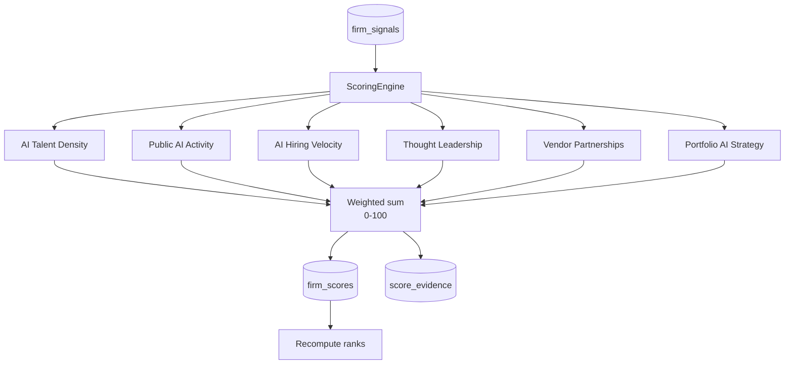
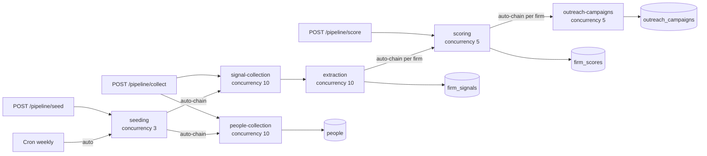

# Data Pipeline — Stages

Four stages, all async via BullMQ, auto-chained by `PipelineOrchestratorService`. Any stage can still be triggered manually through the REST API.

| Stage | Purpose |
|-------|---------|
| 1. Seeding | Build the firm universe from SEC EDGAR, Exa search, and public rankings. Entity-resolve duplicates. Enrich gaps via Wikipedia + Exa + SEC + website crawl. |
| 2. Collection | Per firm: gather raw AI signals (news, hiring, conference, website, LinkedIn) and AI-relevant people (LinkedIn profiles, team pages, SEC Form ADV principals). |
| 3. Extraction | Turn each raw signal source into structured `firm_signals` via a layered cascade (regex → NLP → heuristic → LLM fallback). |
| 4. Scoring | Score each firm across six weighted dimensions → explainable 0–100 overall score with full evidence chain. |

---

## Stage 1 — Seeding & Enrichment

**Queue:** `seeding` (concurrency: 3, 1 attempt)

Runs up to **5 rounds**, each round querying three sources in parallel. Stops early when the DB reaches `target_firm_count` or two consecutive rounds produce zero new firms.

### Entity resolution

Three strategies in order: (1) exact match on normalized name (lowercase, suffix-stripped), (2) website-domain match, (3) Levenshtein distance ≤15% of name length. When duplicates merge, the service keeps the richest data (max AUM, first non-null website/type, etc.) and stores every variant as a `firm_aliases` row.

### Enrichment

After discovery, `FirmEnrichmentService.enrichFirmsWithGaps()` backfills firms missing `website`, `description`, `firm_type`, `headquarters`, `founded_year`, `sec_crd_number`, or `aum_usd`. Wikipedia (structured infobox) + Exa (search snippets) run in parallel, then SEC + website crawl fill remaining gaps. Runs in batches of 15.

---

## Stage 2 — Collection

**Queues:** `signal-collection` and `people-collection` (concurrency: 10 each, lock 5 min, 3 retries w/ exponential 5s backoff)

Two BullMQ jobs per firm, processed in parallel.

### Signal collectors

| Collector | Method | Output | Lookback |
|-----------|--------|--------|----------|
| News | Exa (category: news) | AI-related news mentions | 1 year |
| Hiring | Exa (site-scoped when website known) | Data/ML/AI job postings | 6 months |
| Conference | Exa semantic search | Talks, podcasts, thought-leadership | 2 years |
| Website | Axios + Cheerio on `/`, `/about`, `/technology`, `/data`, `/innovation`, `/portfolio` | HTML → cleaned text | Current |
| LinkedIn signals | Exa scoped to `linkedin.com` | AI adoption posts | 1 year |

### People collectors

| Collector | Method | Output |
|-----------|--------|--------|
| LinkedIn people | Exa scoped to `linkedin.com`, `category: people` | Profile snippets for CDO/CTO/Head-of-Data/VP-Tech roles |
| Website team | Axios + Cheerio on `/team`, `/leadership`, `/people`, `/management`, etc. Falls back to `exa.getContents()` when direct fetch fails. Also extracts `mailto:` anchor + context pairs. | Team-page HTML text, email/name proximity data |
| SEC ADV (IAPD) | Org search → Individual search by firm CRD | Form ADV Schedule A principals with title/bio — pre-structured via `metadata.parsedPeople` |

### People parsing strategy

For each new source:

1. If `metadata.parsedPeople` is present (SEC ADV), use it directly at 0.85 confidence — no LLM needed.
2. Otherwise, call `LlmPeopleExtractor` (batched, up to `LLM_PEOPLE_BATCH_SIZE` per call, configurable via `LLM_PROVIDER`). The LLM returns `{ fullName, title, bio, email, linkedinUrl, confidence }` per source. Never fabricates emails.
3. For LinkedIn sources, the LLM result is filtered to AI-relevant roles only (`HEAD_OF_DATA`, `HEAD_OF_TECH`, `OPERATING_PARTNER`, `AI_HIRE`, or title keywords like *data / AI / analytics / CTO / CDO*).
4. If the LLM returned nothing for a source, regex fallback parses:
   - LinkedIn title patterns (`Name — Title at Firm | LinkedIn`, `Name | Title | LinkedIn`).
   - Website team pages (`Name — Chief/Head/VP/... Title` followed by bio block).
5. Emails are enriched from extracted `mailto:` pairs when the name or surname appears in the anchor context.
6. Within a firm, `(firm_id, full_name)` collisions are skipped.

### Idempotency & dedup

Every collected document is SHA-256 hashed. Before saving, the hash is checked against existing `data_sources`; duplicates are silently skipped. Re-running collection is safe.

### Rate limiting

Token-bucket limiters per external source.

| Source | Max concurrent | Delay |
|--------|----------------|-------|
| Exa | 2 | 500 ms |
| SEC EDGAR / IAPD | 1 | 1200 ms |
| General web (incl. Wikipedia) | 3 | 1000 ms |

### Reliability scoring (data_sources)

| Domain | Score |
|--------|-------|
| `.gov` (SEC, government) | 0.95 |
| Bloomberg / Reuters / WSJ / FT | 0.90 |
| `adviserinfo.sec.gov` (IAPD) | 0.90 |
| TechCrunch / Business Insider | 0.75 |
| LinkedIn | 0.70 |
| Other | 0.50 |

---

## Stage 3 — Extraction (signals only)

**Queue:** `extraction` (concurrency: 10, lock 5 min)

Trigger: each new `data_sources` row from signal collection enqueues one extraction job. People collection does **not** use this queue — people are parsed in the collection service itself.

| Layer | Approach |
|-------|----------|
| Regex | Pattern-matching for executive hires, vendor partnerships, AUM mentions, job postings, conference appearances, portfolio AI mentions. |
| NLP (compromise) | Keyword density across 20+ AI terms, sentence-level intent classification, people-in-AI-sentences detection. |
| Heuristic | Rule-based keyword bundles for leadership roles, operating-partner mandates, portfolio + AI co-mentions, tech stack. |
| LLM fallback | Anthropic (default) or OpenAI. Temperature 0.1, input truncated to 8000 chars, JSON schema-constrained output. Invoked **only** when zero high-confidence results from prior layers. |

Confidence threshold is `EXTRACTION_CONFIDENCE_THRESHOLD` (default `0.5`).

---

## Stage 4 — Scoring

**Queue:** `scoring` (concurrency: 5)

Pure TypeScript, no LLM. `ScoringEngine` reads all `firm_signals` for a firm and passes them through six independent dimension scorers. Each dimension is normalized to 0–100; the overall score is the weighted sum.

### Default weights & scoring logic

| Dimension | Weight | Signal types | Points (caps) |
|-----------|--------|--------------|----------------|
| AI Talent Density | 25% | `ai_team_growth`, `ai_hiring` | Senior hires (Chief/Head/VP/Director): 15pt ea, cap 45 · team growth: 10pt ea, cap 30 · other hires: 5pt ea, cap 25 |
| Public AI Activity | 20% | `ai_news_mention`, `ai_case_study`, `linkedin_ai_activity` | News: 8pt ea, cap 40 · case studies: 15pt ea, cap 35 · LinkedIn: 5pt ea, cap 25 |
| AI Hiring Velocity | 20% | `ai_hiring` | Last 6mo: 12pt ea, cap 50 · older: 5pt ea, cap 25 · role-diversity bonus: 5pt per distinct role, cap 25 |
| Thought Leadership | 15% | `ai_conference_talk`, `ai_podcast`, `ai_research` | Conferences: 15pt ea, cap 40 · podcasts: 12pt ea, cap 30 · research: 15pt ea, cap 30 |
| Vendor Partnerships | 10% | `ai_vendor_partnership`, `tech_stack_signal` | Unique vendors: 20pt ea, cap 60 · tech stack: 10pt ea, cap 40 |
| Portfolio AI Strategy | 10% | `portfolio_ai_initiative`, `ai_case_study` (portfolio-mentioned) | Initiatives: 20pt ea, cap 60 · portfolio case studies: 15pt ea, cap 40 |

Each per-dimension score is clamped to `[0, 100]`. The final `overall_score = Σ (dimension_score × weight)`.

### Evidence chain

Every point contributed to a dimension is logged in `score_evidence` with `(firm_score_id, firm_signal_id, dimension, weight_applied, points_contributed, reasoning)`. Drill from score → dimension → signal → source URL.

### Score versioning & re-scoring

Every scoring run is tagged with `score_version` (e.g. `v1.0`, `v2.0-talent-heavy`). Weights/thresholds live in `scoring_parameters` JSONB. Unique constraint on `(firm_id, score_version)` — re-scoring the same version overwrites in place.

Re-score A/B flow:

1. `POST /api/pipeline/rescore` with new `version` + `weights`.
2. Engine replays existing `firm_signals` through the new config (no re-scraping).
3. New rows appear under the new version tag. Ranks recomputed.
4. Compare via `GET /api/rankings?scoreVersion=...`.

### Min signals gate

Firms with fewer than `min_signals_for_score` signals (default `1`) are skipped (no row written).

---

## Auto-Chaining (Orchestrator)

`PipelineOrchestratorService` glues stages together via Redis counters (`pipeline:firm:{firmId}:pending_extractions`, TTL 24h). Controlled by `PIPELINE_AUTO_CHAIN` (default `true`).

| Chain | Trigger | Action |
|-------|---------|--------|
| Seed → Collection | Seeding processor completes | Query active firms not collected in last 24h → enqueue signal-collection + people-collection jobs |
| Collection → Extraction | New `data_sources` row from signal collection | Enqueue extraction job + increment pending counter |
| Extraction → Scoring | Counter hits zero for firm | Enqueue `scoring` job for that firm |
| Zero-extraction path | Collection produced no new sources, but firm has prior signals | Enqueue scoring immediately |
| Scoring → Outreach | Per-firm scoring job finishes | Enqueue `outreach-campaigns` job (creates campaigns for every person without one) |

**Reliability:** counters auto-expire after 24h; extraction failures still decrement the counter (scoring triggers with whatever succeeded); before enqueuing a scoring job, the orchestrator skips if one is already waiting/active for the same firm.

---

## Queue Architecture

| Queue | Concurrency | Retry | Purpose |
|-------|-------------|-------|---------|
| `seeding` | 3 | 1 attempt | Discover + enrich firms |
| `signal-collection` | 10 | 3 attempts, exp. backoff 5s | Collect AI signal sources per firm |
| `people-collection` | 10 | 3 attempts, exp. backoff 5s | Collect AI-relevant people per firm |
| `extraction` | 10 | — | Turn signal sources into `firm_signals` |
| `scoring` | 5 | — | Score firms across six dimensions |
| `outreach-campaigns` | 5 | — | Auto-seed outreach campaigns per scored firm |

---

## Manual Endpoints

| Endpoint | Use case |
|----------|----------|
| `POST /api/pipeline/seed` | Re-run seeding (auto-chains to collection) |
| `POST /api/pipeline/collect` | Re-collect all firms (excludes ones collected in last 24h) |
| `POST /api/pipeline/:firm_id/collect` | Re-collect a single firm |
| `POST /api/pipeline/score` | Re-score all firms with new version/weights |
| `POST /api/pipeline/rescore` | Sync re-score (no re-scraping) — fast A/B testing |
| `GET /api/pipeline/status` | Queue counts + 20 most recent scrape jobs |

## Scheduled Execution

`PipelineCronService` registers a cron job at startup via `SchedulerRegistry`. Firing enqueues a seeding job with `targetFirmCount = PIPELINE_SEED_TARGET`, which auto-chains through the entire pipeline. Defaults: Sunday midnight, target 50.
