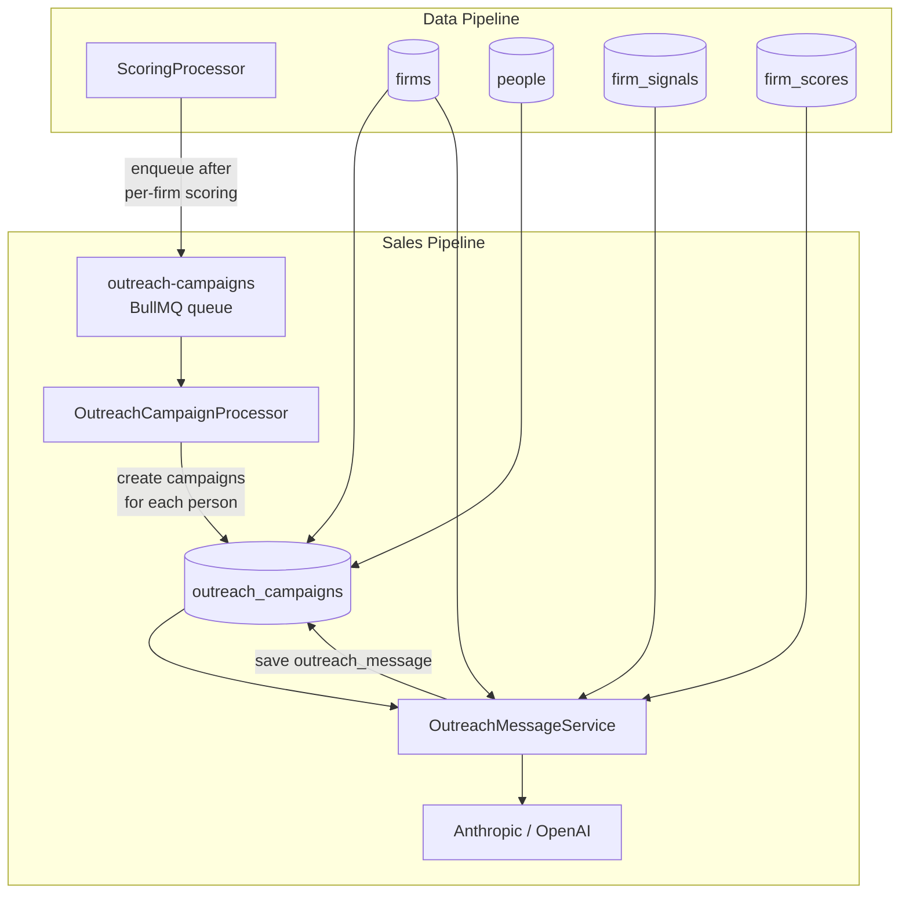
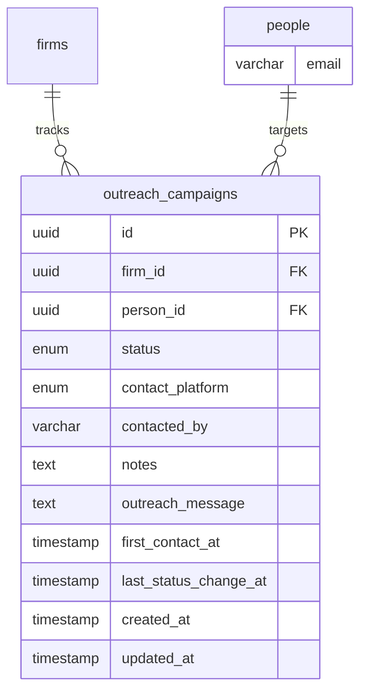
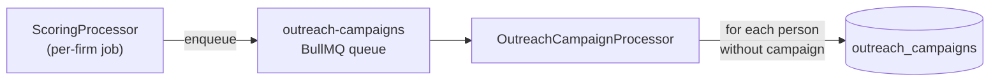
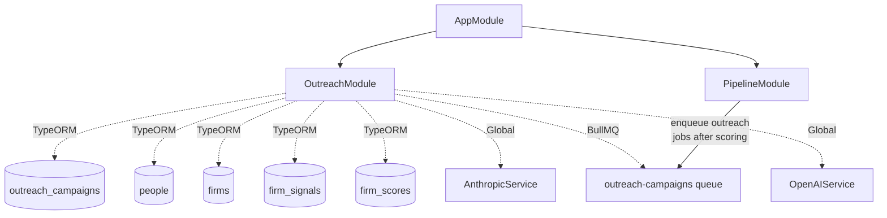

# Sales Pipeline Architecture

## Overview

The sales pipeline extends the data pipeline by turning scored PE firms into actionable sales leads. It automatically creates outreach campaigns for every person at a firm after scoring, and provides LLM-powered personalized message generation for analysts.



## Module Structure

```
backend/src/modules/sales-pipeline/
└── outreach/
    ├── outreach.module.ts                NestJS module (registers BullMQ queue)
    ├── outreach.controller.ts            REST endpoints under /api/outreach
    ├── outreach.service.ts               Campaign CRUD, stats, auto-creation
    ├── outreach-message.service.ts       LLM message generation (per campaign)
    ├── outreach-campaign.processor.ts    BullMQ processor for auto-creating campaigns
    └── dto/
        ├── create-outreach.dto.ts
        ├── update-outreach.dto.ts
        └── query-outreach.dto.ts
```

## Database Schema

### `outreach_campaigns` table

| Column | Type | Description |
|--------|------|-------------|
| `id` | UUID v7 | Primary key |
| `firm_id` | UUID FK | References `firms.id` (CASCADE) |
| `person_id` | UUID FK | References `people.id` (CASCADE) |
| `status` | enum | `OutreachStatus` (default: `not_contacted`) |
| `contact_platform` | enum | `ContactPlatform` (nullable) |
| `contacted_by` | varchar(500) | Analyst name (nullable, immutable once set) |
| `notes` | text | Internal notes (nullable) |
| `outreach_message` | text | LLM-generated or manually edited outreach message (nullable) |
| `first_contact_at` | timestamptz | When first outreach was sent (nullable) |
| `last_status_change_at` | timestamptz | Last status update (nullable) |
| `created_at` | timestamptz | Auto-generated |
| `updated_at` | timestamptz | Auto-generated |

### Changes to `people` table

One column added to the existing `people` entity:

| Column | Type | Description |
|--------|------|-------------|
| `email` | varchar(500) | Person's email address (nullable, extracted during collection) |

Note: `outreach_message` was moved from the `people` table to the `outreach_campaigns` table so that messages are per-campaign, not per-person.

### ER Additions



## Auto-Creation Pipeline

After each per-firm scoring job completes, the `ScoringProcessor` enqueues a job on the `outreach-campaigns` BullMQ queue:



The `OutreachCampaignProcessor`:
1. Loads all people for the firm
2. Checks which people already have campaigns
3. Bulk-creates campaigns for those who don't, with `status: NOT_CONTACTED` and `contacted_by: null`

The queue is registered in both `PipelineModule` (for the scoring hook) and `OutreachModule` (for the processor).

## Outreach Message Generation

### Flow

1. Analyst opens a campaign detail page and clicks "Generate with AI".
2. Frontend calls `POST /api/outreach/:campaignId/generate-message`.
3. `OutreachMessageService` loads the campaign with person and firm relations, then gathers context from:
   - **Person**: name, title, role, bio, LinkedIn
   - **Firm**: name, type, AUM, description
   - **Signals**: up to 15 most recent AI signals (summarized)
   - **Score**: latest overall AI adoption score and rank
   - **Data sources**: up to 5 source excerpts (300 chars each)
4. A system prompt establishes the Soal Labs identity and message guidelines.
5. A user prompt assembles all context into a structured format.
6. The configured LLM provider (`anthropic` or `openai`) generates the message.
7. The message is saved to `campaign.outreach_message` and the full updated campaign is returned.

### Token Optimization

- Signal data is summarized to one-line entries (type + title + confidence).
- Data source snippets are capped at 300 characters each, max 5 sources.
- Person bio is capped at 300 characters.
- Firm description is capped at 400 characters.
- Max output tokens set to 1024.

### LLM Provider

The same `LLM_PROVIDER` env var used by the data pipeline controls which LLM generates outreach messages.

| Provider | Model | Temperature |
|----------|-------|-------------|
| Anthropic (default) | `claude-sonnet-4-20250514` | default |
| OpenAI | `gpt-4o` | 0.7 |

### Message Persistence

Generated messages are saved to `campaign.outreach_message`. The message is editable by the analyst in the campaign detail page and saved via the normal `PATCH /:id` endpoint. Re-generating always overwrites the existing message.

## `contacted_by` Immutability

Once `contacted_by` is set on a campaign (either via manual update or during creation), it cannot be changed. The backend ignores `contacted_by` updates on campaigns that already have a non-null value. The frontend enforces this by rendering the field as read-only once set.

## Module Dependency Graph


