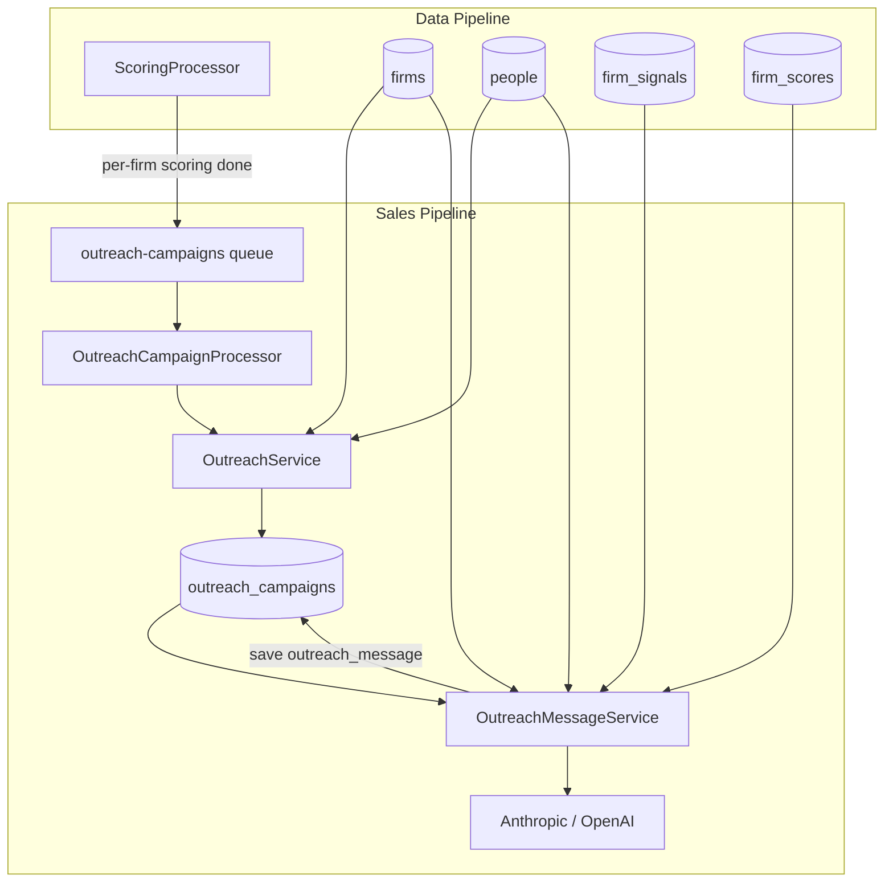
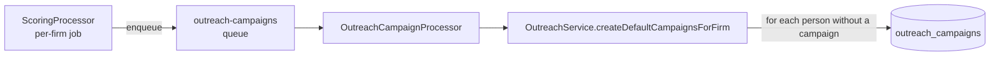
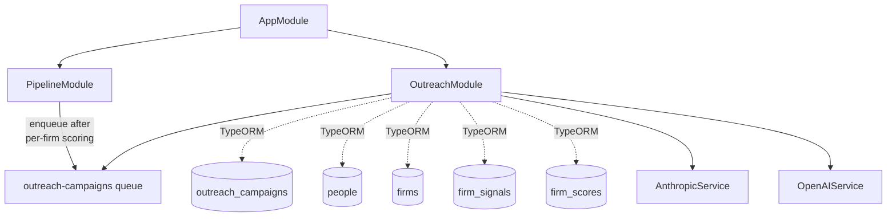

# Sales Pipeline — Architecture

## Overview

The sales pipeline turns scored PE firms into actionable leads. Whenever a firm finishes scoring, an outreach campaign is auto-created for every person at that firm. Analysts can generate personalized outreach messages via LLM on demand.



## Module Structure

```
backend/src/modules/sales-pipeline/outreach/
├── outreach.module.ts                    Registers outreach-campaigns queue
├── outreach.controller.ts                REST endpoints under /api/outreach
├── outreach.service.ts                   CRUD + stats + bulk auto-creation
├── outreach-message.service.ts           LLM message generation
├── outreach-campaign.processor.ts        BullMQ processor for auto-creation
└── dto/
    ├── create-outreach.dto.ts
    ├── update-outreach.dto.ts
    ├── query-outreach.dto.ts
    └── outreach-response.dto.ts
```

## Database

### `outreach_campaigns` table

| Column | Type | Notes |
|--------|------|-------|
| `id` | UUID v7 | PK |
| `firm_id` | UUID FK | → `firms.id`, CASCADE delete |
| `person_id` | UUID FK | → `people.id`, CASCADE delete |
| `status` | enum `OutreachStatus` | Default `not_contacted` |
| `contact_platforms` | enum array `ContactPlatform[]` | Multi-select (can include `email`, `linkedin`, `phone`, `other`). Default `[]`. |
| `contacted_by` | varchar(500) | Analyst name. **Immutable once set.** |
| `notes` | text | Internal notes |
| `outreach_message` | text | LLM-generated or analyst-edited message body |
| `first_contact_at` | timestamptz | Auto-set when status flips to `first_contact_sent` |
| `last_status_change_at` | timestamptz | Touched on any status change |
| `created_at` / `updated_at` | timestamptz | Auto |

### `people.email`

An `email` column was added to the `people` entity (nullable). Extracted during people collection from `mailto:` anchors on team pages or from LLM output (never fabricated).

## Auto-Creation Flow



`OutreachCampaignProcessor`:

1. Loads all `people` rows for the firm.
2. Looks up existing campaigns by `firm_id` to skip people already covered.
3. Bulk-creates campaigns with `status: NOT_CONTACTED`, `contacted_by: null`, `contact_platforms: []`.

Job id is deterministic (`outreach-${firmId}`) so duplicate scoring runs don't create duplicate jobs.

## Outreach Message Generation

### Flow

1. Analyst clicks "Generate with AI" on a campaign detail page.
2. Frontend → `POST /api/outreach/:campaignId/generate-message`.
3. `OutreachMessageService` loads the campaign with `person` + `firm`, then fetches:
   - Up to 15 most recent `firm_signals` (with `data_source` relation).
   - Latest `firm_score`.
4. Builds prompts:
   - **System prompt**: Soal Labs identity + message style guidelines (under 200 words, warm-peer tone, reference specific AI signals, soft CTA).
   - **User prompt**: structured person + firm context + signal summaries + AI score + up to 5 source excerpts (300 chars each).
5. Calls the configured LLM provider.
6. Writes the result to `campaign.outreach_message` and returns the full updated campaign.

### Providers

| Provider | Model | Notes |
|----------|-------|-------|
| Anthropic (default) | `claude-sonnet-4-20250514` | Chosen when `LLM_PROVIDER=anthropic` (default) |
| OpenAI | `gpt-4o` | Chosen when `LLM_PROVIDER=openai` |

Max output tokens: 1024. Temperature: 0.7 (OpenAI) / default (Anthropic).

### Token optimisation

- Signals reduced to one-line summaries (`[type] title (confidence: x)`).
- Source snippets capped at 300 chars, max 5 sources.
- Person bio capped at 300 chars; firm description at 400 chars.

### Persistence & editing

Generated messages are stored on the campaign row. The analyst can edit the message via `PATCH /api/outreach/:id` with `outreach_message`. Calling `generate-message` again overwrites any existing text.

## `contacted_by` Immutability

Once `contacted_by` is non-null, `OutreachService.update` ignores further attempts to change it. The frontend enforces read-only display. Auto-created campaigns start with `contacted_by: null`, so an analyst can claim ownership on first update.

## Module Dependency Graph


