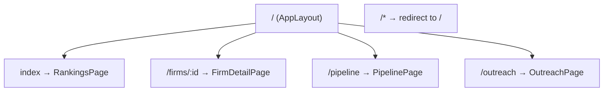
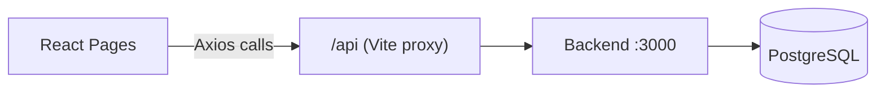

# Frontend Architecture

## Overview

A single-page React application that serves as an internal analyst console. It consumes the backend REST API to display firm rankings, AI adoption scores, and pipeline status. There is no authentication — it is designed for internal use behind a private network.

## Technology Stack

| Layer | Technology | Purpose |
|-------|-----------|---------|
| Framework | React 19 | UI rendering with React Compiler for auto-memoization |
| Bundler | Vite 8 | Dev server with HMR, production builds, API proxy |
| Language | TypeScript 6 | Strict type-checking, `bundler` module resolution |
| Routing | React Router 7 | Client-side SPA routing with nested layouts |
| Data Grids | AG Grid Community 35 | Rankings tables, signals, evidence, people, jobs |
| UI Primitives | shadcn/ui + Radix UI | Accessible components (Button, Card, Select, Tabs, etc.) |
| Styling | Tailwind CSS v4 | Utility-first CSS via `@tailwindcss/vite` (no config file) |
| Icons | Lucide React | Consistent icon set |
| HTTP | Axios | API client with base URL `/api` |
| Font | Geist Variable | Clean variable-weight sans-serif |
| Animations | tw-animate-css | Tailwind animation utilities |

## Project Structure

```
frontend/
├── index.html                          SPA shell
├── vite.config.ts                      Vite plugins, @/ alias, /api proxy
├── components.json                     shadcn/ui config (radix-nova style)
├── tsconfig.json                       Solution-style root
├── tsconfig.app.json                   App config (ES2023, bundler, strict)
│
├── docs/
│   ├── data-pipeline.md                Page docs for Rankings, Firm Detail, Pipeline
│   └── sales-pipeline.md              Page docs for Outreach, message generation
│
└── src/
    ├── main.tsx                        Entry point, TooltipProvider wrapper
    ├── App.tsx                         Router definition (4 routes + catch-all)
    ├── index.css                       Tailwind imports, theme tokens (oklch), AG Grid theme
    │
    ├── api/                            Backend communication layer
    │   ├── client.ts                   Axios instance (baseURL: '/api')
    │   ├── rankings.ts                 Rankings + dimension breakdown
    │   ├── firms.ts                    Firm list, detail, signals, scores
    │   ├── people.ts                   People listing
    │   ├── pipeline.ts                 Pipeline status
    │   └── outreach.ts                 Outreach campaigns + message generation
    │
    ├── pages/
    │   ├── rankings.tsx                Home — ranked firm grid with filters
    │   ├── firm-detail.tsx             Firm drill-down: score, people, signals, evidence, outreach
    │   ├── pipeline.tsx                Queue health dashboard (auto-polls every 15s)
    │   └── outreach.tsx                Sales outreach campaign dashboard
    │
    ├── components/
    │   ├── layout/app-layout.tsx       Sidebar navigation (grouped: Data Pipeline / Sales Pipeline)
    │   ├── page-nav.tsx                Pagination: page jump, prev/next, totals
    │   ├── empty-state.tsx             Dashed-border empty placeholder
    │   ├── ui/                         shadcn-generated primitives (Badge, Button, Card, etc.)
    │   ├── firm-detail/                Firm detail components (header, scores, people, signals)
    │   ├── rankings/                   Rankings table and filters
    │   ├── pipeline/                   Pipeline queue cards and job list
    │   └── sales-pipeline/            Outreach components (stats bar, detail card, badges)
    │
    ├── hooks/
    │   ├── use-firm-detail.ts          Firm data, people, scores
    │   ├── use-firm-signals.ts         Paginated firm signals
    │   ├── use-pipeline-status.ts      Pipeline queue polling
    │   ├── use-rankings.ts             Rankings with pagination
    │   └── use-outreach.ts             Outreach campaigns and stats
    │
    ├── lib/
    │   ├── utils.ts                    cn() — clsx + tailwind-merge
    │   ├── format.ts                   formatDate, formatAumUsd, formatScore, labelFromSnake
    │   ├── errors.ts                   getErrorMessage (Axios-aware)
    │   └── grid.ts                     AG Grid module registration, Quartz theme, shared defaults
    │
    └── types/                          TypeScript types aligned with API response shapes
        ├── common.ts                   Enums: FirmType, SignalType, RoleCategory, OutreachStatus, etc.
        ├── firm.ts                     Firm, FirmAlias
        ├── person.ts                   Person (with email, outreach_message)
        ├── signal.ts                   FirmSignal
        ├── score.ts                    FirmScore, ScoreEvidence, DimensionScore
        ├── rankings.ts                 RankingRow, DimensionBreakdown
        ├── pipeline.ts                 QueueCounts, RecentJob, PipelineStatus
        └── outreach.ts                 OutreachCampaign, OutreachStats
```

## Routing



`AppLayout` provides a persistent sidebar with nav links grouped into two sections:
- **Data Pipeline**: Rankings, Pipeline
- **Sales Pipeline**: Outreach

Firm detail is reached by clicking a row in the rankings grid.

## Data Flow



- All API calls go through the Axios client at `src/api/client.ts` (`baseURL: '/api'`).
- In development, Vite proxies `/api` to `http://localhost:3000`.
- In production, the frontend is built as static files and served behind a reverse proxy that routes `/api` to the backend.
- Every API function accepts an optional `AbortSignal` for request cancellation in `useEffect` cleanups.

## State Management

No external state library. The app uses local React state only:

- `useState` + `useEffect` for data fetching in each page.
- `useMemo` for derived computations (e.g. dimension score rows).
- `setInterval` for pipeline status polling (15-second interval).

## Styling

- **Tailwind v4** — driven from CSS (`@import 'tailwindcss'`) with the `@tailwindcss/vite` plugin. No `tailwind.config.js` file.
- **Theme tokens** defined in `src/index.css` using `@theme inline` and oklch CSS custom properties. Supports light and dark mode (`.dark` class on ancestor).
- **shadcn/ui** components use `class-variance-authority` for variant styling and `cn()` (clsx + tailwind-merge) for class composition.
- **AG Grid** is themed via CSS variables in `.ag-theme-custom` that map to the same design tokens, so grids match the app's look and feel.

## Pages Detail

Page-specific documentation is organized by domain:

- **[Data Pipeline Pages](data-pipeline.md)** — Rankings, Firm Detail, Pipeline
- **[Sales Pipeline Pages](sales-pipeline.md)** — Outreach, message generation, firm outreach card

## Scripts

| Script | Description |
|--------|-------------|
| `pnpm dev` | Start Vite dev server with HMR and API proxy |
| `pnpm run build` | Type-check with `tsc` then build production bundle |
| `pnpm run preview` | Serve the production build locally |
| `pnpm run lint` | Run ESLint |
| `pnpm run format` | Run Prettier on all files |

## Key Design Decisions

### No state management library

The app has four pages with independent data needs and no shared mutable state. Local `useState` + `useEffect` keeps things simple and avoids unnecessary abstraction.

### AG Grid for all tables

AG Grid provides sorting, column resizing, and a professional data-dense look out of the box. It's used consistently across all pages for a uniform experience.

### Vite dev proxy instead of CORS

The dev proxy at `/api → localhost:3000` means the frontend and backend share the same origin during development, eliminating CORS configuration. In production, the same pattern applies via reverse proxy.

### React Compiler

Enabled via `@rolldown/plugin-babel` with `reactCompilerPreset()`. Provides automatic memoization without manual `useMemo`/`useCallback`, reducing boilerplate.

### Tailwind v4 (CSS-first)

No `tailwind.config.js` — all theme customization lives in `src/index.css` using the new CSS-native `@theme` directive. This keeps configuration co-located with styles.
